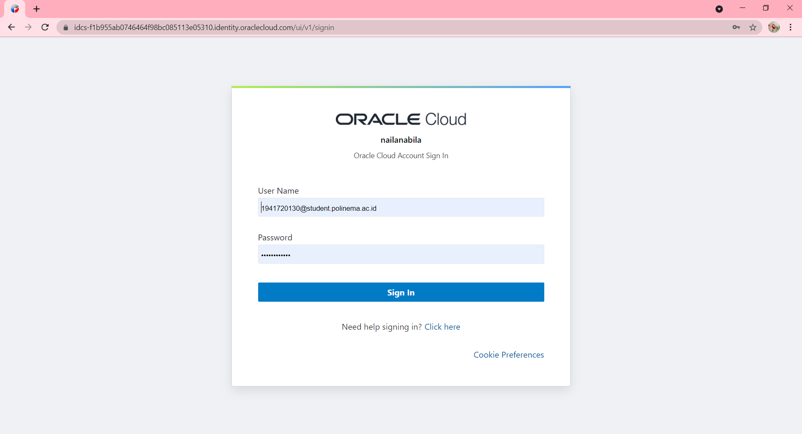
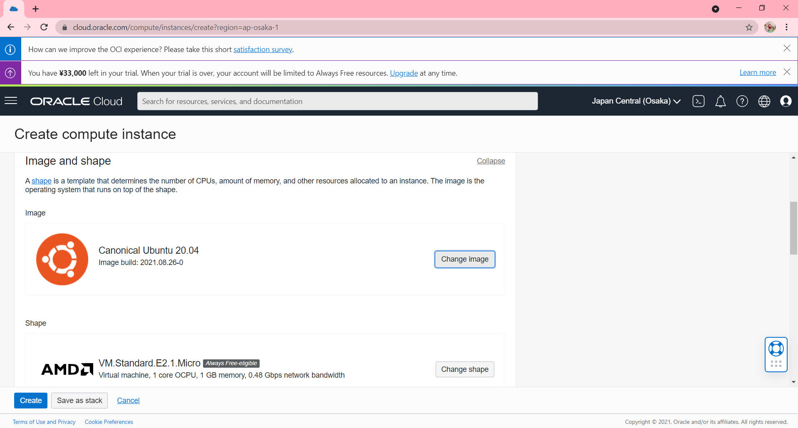

# 03 - Membuat Virtual Machine

## Tujuan Pembelajaran

1. Mengetahui layanan Oracle Cloud Infrastructure Compute
2. Mampu membuat Virtual Machine (VM) di layanan compute Oracle Cloud

## Hasil Praktikum

Praktikum - Membuat VM di Oracle Cloud 

Pada gambar berikut adalah ilustrasi membuat sebuah VM Linux Instance. Untuk bisa mengaksesnya saya harus menggunnakan SSH Key dihubungkan melalui internet gateway kemudian melewati VCN selanjutnya baru masuk bagian ke subnet tempat VM itu berada di Oracle data center.

- Langkah 1 :

  Login ke akun Oracle Cloud.

  

  Setelah itu, maka akan ke halaman dashboard.

  

- Langkah 2 :

  Setelah berhasil login dan masuk pada halaman beranda Oracle Cloud, saya pilih menu di pojok kiri atas, lalu pilih menu Compute > Instances.

  

- Langkah 3 :

  Pilih Create instance untuk membuat VM baru. Pada gambar berikut akan tampil nama, status, dll terkait VM yang pernah di buat. Jika belum ada, berarti VM belum pernah dibuat. 

  

  Jika tidak ada Create Instance, maka pada List Scope terdapat Compartment, klik Pick a compartment kemudian pilih nama akun.

- Langkah 4 :

  Memberi nama VM sesuai dengan keinginan. Misalnya di sini saya beri nama vm-ubuntu. Untuk compartment biarkan secara default dan placement pastikan Always Free-eligible (biasanya secara default sudah terpilih, jadi tidak perlu diatur lagi).

  

- Langkah 5 :

  Pada bagian Image and shape silakan atur sistem operasi yang akan kita gunakan, ubah menjadi Ubuntu dengan cara klik Edit. Untuk bagian shape biarkan saja, secara default biasanya menggunakan AMD VM.Standard.E2.1.Micro Always Free-eligible dengan 1 core CPU dan 1 GB RAM. 

  

  Melakukan perubahan sistem operasi dengan klik Change image. 

  

  Pilih Canonical Ubuntu versi 20.04, lalu klik Select image.

  

  Maka Image akan berubah seperti dibawah ini.

  

- Langkah 6 :

  Pada bagian Networking biarkan saja pengaturannya. Secara default, akses SSH port 21 sudah bisa diakses.

  

  Selanjutnya bagian SSH keys, perlu klik Save Private Key untuk mengunduh private key agar nanti VM bisa diakses. 

  

- Langkah 7 :

  Untuk kapasitas disk bisa di atur sesuai kebutuhan, namun di sini biarkan secara default, yaitu disk bervolume 46.6 GB. Langkah terakhir klik Create di pojok kiri bawah untuk memulai membuat VM. 

  

  Tunggu prosesnya sekitar 2-5 menit sampai tampil status state VM kita adalah running.

  

  
