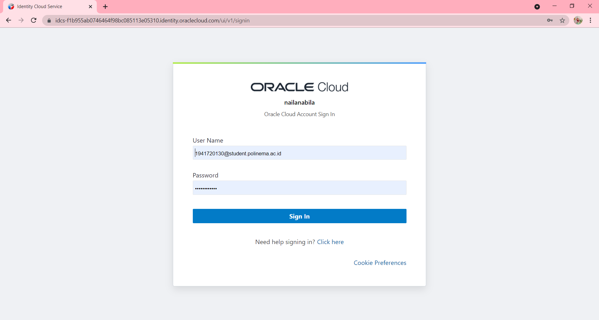
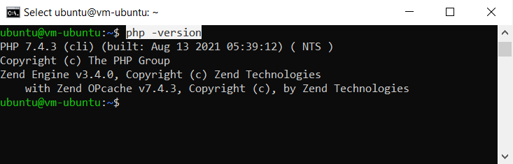

# 04 - Virtual Cloud Network ( VCN )

## Tujuan Pembelajaran

1. Mengetahui layanan Oracle Cloud Infrastructure Networking.
2. Mampu mengaktifkan port 80 melalui Virtual Cloud Network (VCN) di layanan Oracle Cloud.
3. Mampu memasang Apache server dan mengonfigurasi IP tables Firewalls.

## Hasil Praktikum

### Praktikum 1 : Mengaktifkan Port 80 melalui VCN di Oracle Cloud

- Langkah 1 : Login ke akun Oracle Cloud melalui tautan ini https://www.oracle.com/cloud/sign-in.html 

  

- Langkah 2 : Setelah berhasil login dan ada di beranda Oracle Cloud, pilih menu di pojok kiri atas, lalu pilih menu Networking > Virtual Cloud Networks 

  

- Langkah 3 : Memastikan VCN sudah ada, biasanya jika berhasil telah membuat VM dari modul pertemuan sebelumnya maka VCN akan tampil di sini. Lalu, klik nama VCN tersebut. 

  

- Langkah 4 : Pilih Security Lists di panel kiri (Resources), lalu pilih Default Security List di tabel yang tersedia.

  

- Langkah 5 : Klik tombol biru Add Ingress Rules untuk menambahkan port. 

  

  Isilah ingress rule dengan nilai-nilai seperti gambar di bawah ini. Setelah itu, klik tombol Add Ingress Rules.

  
 
  Sekarang koneksi HTTP telah diizinkan. VCN Telah dikonfigurasi untuk Apache server. 
  Ingress rule berfungsi untuk membuka port 80 HTTP server VM agar bisa diakses oleh publik. 

  

### Praktikum 2 : Setup Apache di VM

- Langkah 1 : Buka instance melalui menu Compute > Instances, kemudian copy IP public VM yang ingin di akses untuk diatur web server Apache.

  

- Langkah 2 : Melakukan akses ke VM atau server kita dengan perintah berikut ini.

  

- Langkah 3 : Setelah terkoneksi dengan VM, lalu melakukan perintah berikut baris demi baris untuk menginstall Apache server.

  

  

- Langkah 4 : Menjalankan service Apache dengan perintah berikut.

  

- Langkah 5 : Secara default pada VM Ubuntu kita untuk firewall itu statusnya disabled (tidak aktif), maka perlu mengaktifkannya dengan melakukan update pada iptabels terlebih dahulu. Dengan perintah berikut baris demi baris.

  

  

- Langkah 6 : Sekarang sudah dapat melakukan uji server VM kita dengan perintah curl localhost atau buka browser di komputer/laptop pribadi dan arahkan ke IP public VM yang dimiliki. Jika sukses, maka akan tampil seperti gambar berikut ini.

  

## Tugas Praktikum

Tugas - Menginstall PHP di VM

- Langkah 1 : Masuk ke VM terlebih dahulu, dengan perintah yang saya blok pada gambar dibawah ini.

  

- Langkah 2 : Setelah itu melakukan install apache, dengan perintah yang saya blok pada gambar dibawah ini.

  

- Langkah 3 : Lalu, memastikan jika sudah terinstal, dengan perintah yang saya blok pada gambar dibawah ini.

  