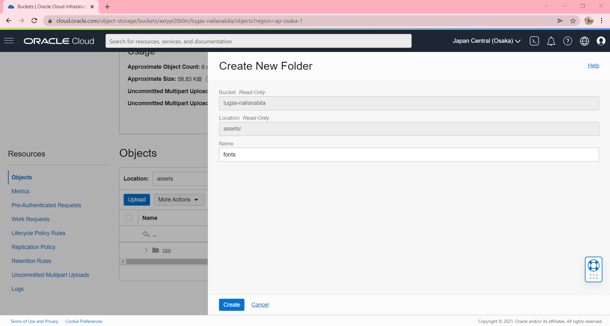
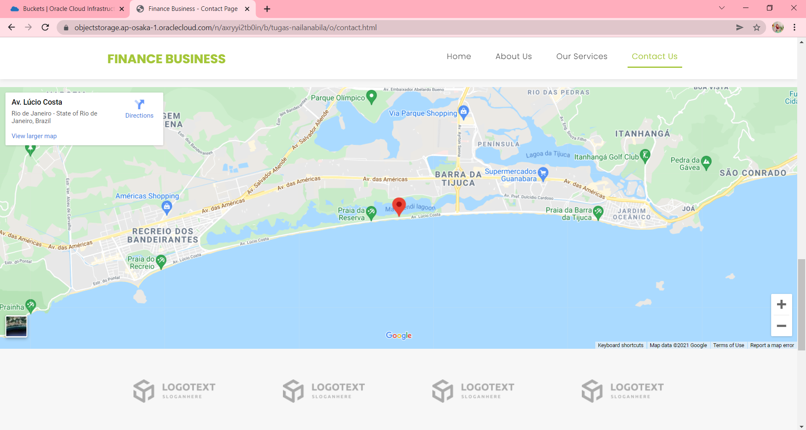

# 08 - OBJECT STORAGE

## Tujuan Pembelajaran
1. Mengetahui Object Storage yang ditawarkan Oracle Cloud Infrastructure (OCI)
2. Dapat memanfaatkan layanan Object Storage yang ditawarkan Oracle Cloud Infrastructure (OCI)

## Hasil Praktikum : Object Storage
Pada praktikum kali ini  kita akan membuat sataic website kemudian menghostinya ke Oracle Object
Storage. OCI memiliki free tier, salah satunya adalah object storage yang bisa digunakan untuk
menyimpan file dan berjalan pada protokol https. 

1. Membuat bucket untuk website. Sign-in ke OCI kemudian pilih Object Storage.
    

    - Create Bucket → Pilih standar bucket.
        

    - Untuk free tier mendapatkan gratis 10 GB Object Storage dan 10 GB archive storage (jika penggunaan lebih dari 20 GB dan tidak melakukan upgrade dari free trial maka otomatis data akan dihapus). 

    - (Bucket Name → bebas) 
        

    - Hasil Setelah create bucket
        

    - Buka bucket dengan melakukan klik pada nama bucket.
        

    - Kemudian pilih Edit Visibility. 
        

    - Pilih Visibility menjadi Public. Tekan Save Changes untuk menyimpan perubahan.
        

2. Uploading web page. Pada bagian bawah dari Bucket Information terdapat box Object (upload semua file yang ada pada folder colorFliper).
    

    - Upload semua file yang ada pada folder colorFliper.
        
        

    - Hasil setelah upload file.
    

    - Setelah upload index.html file → Klik titik 3 pada sisi kiri file index.html.
    - Kemudian pilih View Object Detail (Panel detail akan menunjukkan detail URL objek)
        

    - Kemudian pilih URL Path (URI) untuk membuka file
        

    - Jika file yang di upload berhasil tampilan pada halaman akan seperti pada gambar di bawah ini:
        

## Hasil Tugas Praktikum : Object Storage

1. Carilah aplikasi web static kemudian upload ke Object Storage yang telah Anda buat.
    - Membuat bucket untuk website. Sign-in ke OCI kemudian pilih Object Storage.
        
    - Create Bucket.
        
        
    - Hasil Create Bucket.
        
    - Mengedit Visibility.
        
    - Edit Visibility menjadi Public.
        
    - Melakukan Uploading Web Page.
        
        - Create Folder Assets.
            
            
        - Hasil Create Folder Assets.
            
        - Create Folder Css didalam Folder Assets.
            
            
        - Hasil Create Folder Css didalam Folder Assets.
            
        - Upload File di Folder Css yang didalam Folder Assets.
            
            
            
        - Hasil Upload File di Folder Css yang didalam Folder Assets.
            
        - Create Folder Fonts didalam Folder Assets.
            
        - Hasil Create Folder Fonts didalam Folder Assets.
            
        - Upload File di Folder Fonts yang didalam Folder Assets.
            
            
            
        - Hasil Upload File di Folder Fonts yang didalam Folder Assets.
            
        - Create Folder Images didalam Folder Assets.
            
        - Hasil Create Folder Images didalam Folder Assets.
            
        - Upload File di Folder Images yang didalam Folder Assets.
            
            
            
        - Hasil Upload File di Folder Images yang didalam Folder Assets.
            
        - Create Folder Js didalam Folder Assets.
            
        - Hasil Create Folder Js didalam Folder Assets.
            
        - Upload File di Folder Js yang didalam Folder Assets.
            
            
            
        - Hasil Upload File di Folder Js yang didalam Folder Assets.
            
        - Create Folder Vendor.
            
            
        - Hasil Create Folder Vendor.
            
        - Create Folder Bootstrap didalam Folder Vendor.
            
            
        - Hasil Create Folder Bootstrap didalam Folder Bootstrap pada Vendor.
            
        - Create Folder Css didalam Folder Bootstrap pada Vendor.
            
            
        - Hasil Create Folder Css didalam Folder Bootstrap pada Vendor.
            
        - Upload File pada Folder Css didalam Folder Bootstrap pada Vendor.
            
            
            
        - Hasil Upload File pada Folder Css didalam Folder Bootstrap pada Vendor.
            
        - Create Folder Js didalam Folder Bootstrap pada Vendor.
            
        - Hasil Create Folder Js didalam Folder Bootstrap pada Vendor.
            
        - Upload File pada Folder Js didalam Folder Bootstrap pada Vendor.
            
            
            
        - Hasil Upload File pada Folder Js didalam Folder Bootstrap pada Vendor.
            
        - Create Folder JQuery didalam Folder Vendor.
            
        - Hasil Create Folder JQuery didalam Folder Vendor.
            
        - Upload File pada Folder JQuery didalam Folder Vendor.
            
            
            
        - Hasil Upload File pada Folder JQuery didalam Folder Vendor.
            
        - Upload File HTML pada box object.
            
            
            
        - Hasil Upload File HTML pada box object.
            
        - View Object Details pada index.html.
            
        - Kemudian pada Object Details, klik URL.
            
        - Hasil jika sukses mengupload aplikasi web static ke object storage seperti pada gambar berikut.
        - **Halaman Home**
            
            
            
            
            
            
            
        - **Halaman About**
            
            
            
            
            
            
        - **Halaman Services**
            
            
            
            
        - **Halaman Contact**
            
            
            
            
            

        
