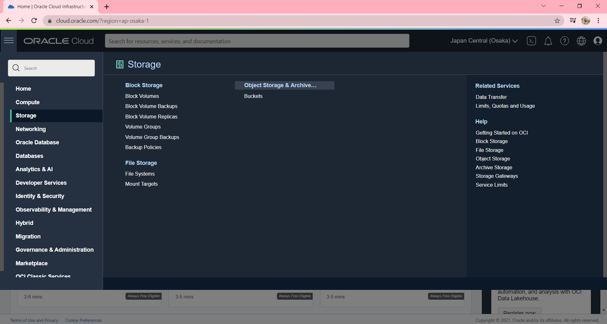

# 08 - OBJECT STORAGE

## Tujuan Pembelajaran
1. Mengetahui Object Storage yang ditawarkan Oracle Cloud Infrastructure (OCI)
2. Dapat memanfaatkan layanan Object Storage yang ditawarkan Oracle Cloud Infrastructure (OCI)

## Hasil Praktikum : Object Storage
Pada praktikum kali ini  kita akan membuat sataic website kemudian menghostinya ke Oracle Object
Storage. OCI memiliki free tier, salah satunya adalah object storage yang bisa digunakan untuk
menyimpan file dan berjalan pada protokol https. 

1. Membuat bucket untuk website. Sign-in ke OCI kemudian pilih Object Storage.
    

    - Create Bucket → Pilih standar bucket.
        

    - Untuk free tier mendapatkan gratis 10 GB Object Storage dan 10 GB archive storage (jika penggunaan lebih dari 20 GB dan tidak melakukan upgrade dari free trial maka otomatis data akan dihapus). 

    - (Bucket Name → bebas) 
        

    - Hasil Setelah create bucket
        

    - Buka bucket dengan melakukan klik pada nama bucket.
        

    - Kemudian pilih Edit Visibility. 
        

    - Pilih Visibility menjadi Public. Tekan Save Changes untuk menyimpan perubahan.
        

2. Uploading web page. Pada bagian bawah dari Bucket Information terdapat box Object (upload semua file yang ada pada folder colorFliper).
    

    - Upload semua file yang ada pada folder colorFliper.
        
        

    - Hasil setelah upload file.
    

    - Setelah upload index.html file → Klik titik 3 pada sisi kiri file index.html.
    - Kemudian pilih View Object Detail (Panel detail akan menunjukkan detail URL objek)
        

    - Kemudian pilih URL Path (URI) untuk membuka file
        

    - Jika file yang di upload berhasil tampilan pada halaman akan seperti pada gambar di bawah ini:
        