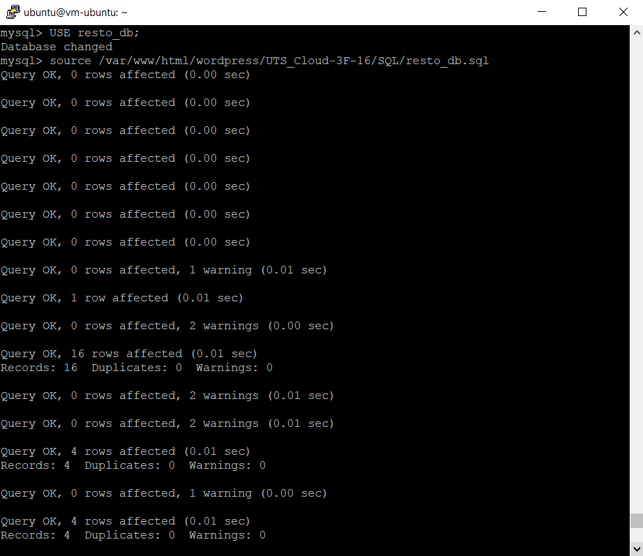
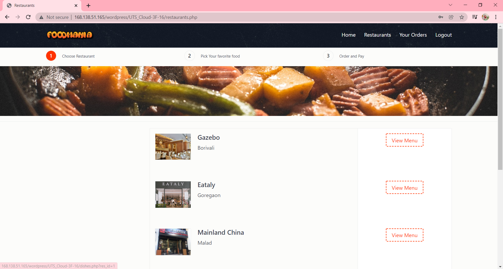
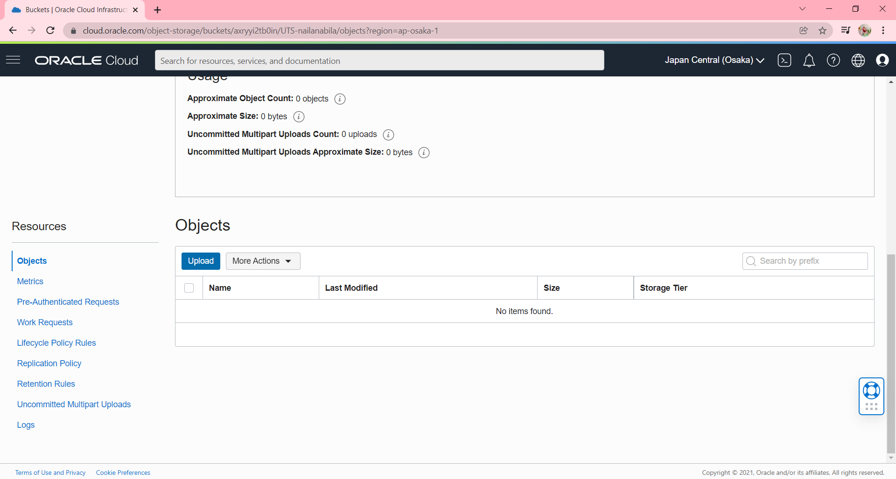
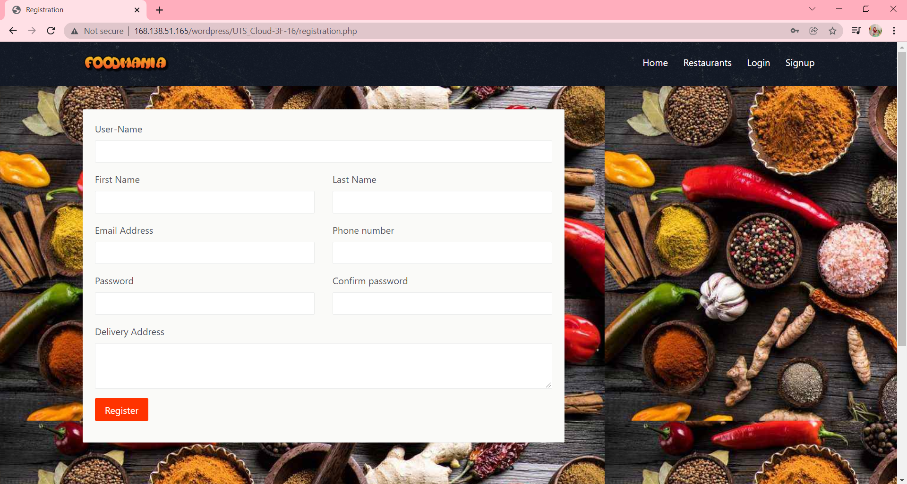
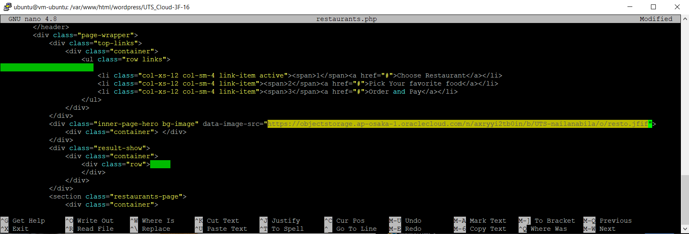

# 09 - UTS

## SOAL UTS
- Silakan masing-masing individu memanfaatkan object storage sebagai media penyimpanan assets (gambar, file2 upload, dsb) berdasarkan project Kuis 1 kemarin yaitu aplikasi Wordpress.
- Sehingga hasil akhir utk UTS aplikasi dpt memanfaatkan VM, DB instance dan Object Storage.
- Buatlah laporan di masing-masing repo private GitHub Anda!
- Deadline 2 Nov 2021 Jam 07:00 WIB.

## Hasil UTS

1. Membuka VM melalui Putty
    

2. Masuk ke mysql dengan perintah **"mysql -u admin -p -h 10.0.0.244"**, dan masukkan password yang sudah pernah dibuat.
    

3. Membuat database dengan perintah **"CREATE DATABASE resto_db;"**.
    
    
4. Untuk melihat database yang sudah dibuat, dengan perintah **"SHOW DATABASES;"**.
    

5. Setelah itu ketikkan **"EXIT"** untuk keluar dari mysql.
    

6. Untuk melakukan clone pada folder /var/www/html/wordpress, masuk ke direktori dahulu dengan ketikkan **"cd /var/www/html/wordpress"**. Setelah itu untuk melakukan clone, ketikkan **"sudo git clone https://github.com/nailanabilaaaaaa/Project-Restaurant.git UTS_Cloud-3F-16"**, lalu proses clone akan berjalan.
    

7. Untuk mengecek apakah hasil clone sudah masuk ke dalam folder **/var/www/html/wordpress**, masuk ke direktori dahulu dengan ketikkan **"cd /var/www/html/wordpress"**. Setelah itu untuk mengecek ketikkan **"ls"** seperti pada gambar berikut.
    

8. Selanjutnya, masuk ke mysql dengan perintah **"mysql -u admin -p -h 10.0.0.244"**, dan masukkan password yang sudah pernah dibuat.
    

9. Untuk melakukan import SQL dari Project-Restaurant, pertama ketikkan **"USE resto_db"** karena database yang kita tuju untuk import yaitu, resto_db. Kemudian untuk mengimport ketikkan **"source /var/www/html/wordpress/UTS_Cloud-3F-16/SQL/resto_db.sql"**. Jika import berhasil, maka akan terdapat output **Query OK**.
    
    

10. Untuk melihat tabel hasil import SQL pada database **resto_db**, ketikkan perintah **"SHOW TABLES"**.
    

11. Untuk mengkoneksikan, masuk ke direktori dahulu dengan ketikkan **"cd /var/www/html/wordpress/UTS_Cloud-3F-16/connection"**. Setalah itu buka file **connect.php** dengan ketikkan perintah **"sudo nano connect.php"**
    

12. Kemudian, pada file **connect.php** mengubah pada bagian **$servername**, **$username**, **$password**, dan **$dbname**.
    

13. Setelah itu buka web dengan ketikkan **http://168.138.51.165/wordpress/UTS_Cloud-3F-16/**, maka akan muncul tampilan web seperti gambar berikut.
    - Tampilan Awal
        
    - Halaman Sign Up
        
    - Halaman Log In
        
    - Halaman Home
        
    - Halaman Restaurant
        

14. Melakukan **Create Bucket**.
    
    
    Hasil setelah melakukan **Create Bucket**.
    

15. Melakukan **Edit Visibility**.
    

    **Edit Visibility** menjadi **Public**.
    

    Hasil setelah **Edit Visibility**.
    

16. Pada bagian **Objects**, klik **Upload**.
    

    Lalu pilih file yang akan diupload, setelah itu klik **Upload**.
    

    Jika berhasil upload maka akan ada keterangan **Finished**.
    

    Hasil **Upload Object**.
    

    Pada **Object Details** copy link URL.
    

17. Untuk mencoba mengubah tampilan pada **Halaman Home**, masuk ke direktori dahulu dengan ketikkan **"cd /var/www/html/wordpress/UTS_Cloud-3F-16/"**. Setelah itu, untuk membuka file **index.php**, ketikkan perintah **sudo nano index.php**.
    
    
    Maka akan membuka file **index.php**. Setelah itu, mengubah background dengan masukkan link URL object storage yang sudah di copy pada **Object Details**.
    

    Hasil tampilan **Halaman Home** setelah dirubah dengan Object Storage.
    

18. Pada bagian **Objects**, klik **Upload**. Setelah itu, pilih file yang akan diupload, klik **Upload**.
    

    Jika berhasil upload maka akan ada keterangan **Finished**.
    

    Hasil **Upload Object**.
    

    Pada **Object Details** copy link URL.
    

19. Untuk mencoba mengubah tampilan pada **Halaman Login**, masuk ke direktori dahulu dengan ketikkan **"cd /var/www/html/wordpress/UTS_Cloud-3F-16/"**. Setelah itu, untuk membuka file **login.php**, ketikkan perintah **sudo nano login.php**.
    

    Maka akan membuka file **login.php**. Setelah itu, mengubah background dengan masukkan link URL object storage yang sudah di copy pada **Object Details**.
    

    Hasil tampilan **Halaman Login** setelah dirubah dengan Object Storage.
    

20. Pada bagian **Objects**, klik **Upload**. Setelah itu, pilih file yang akan diupload, klik **Upload**.
    

    Jika berhasil upload maka akan ada keterangan **Finished**.
    

    Hasil **Upload Object**.
    

    Pada **Object Details** copy link URL.
    

21. Untuk mencoba mengubah tampilan pada **Halaman Sign Up**, masuk ke direktori dahulu dengan ketikkan **"cd /var/www/html/wordpress/UTS_Cloud-3F-16/"**. Setelah itu, untuk membuka file **registration.php**, ketikkan perintah **sudo nano registration.php**.
    

    Maka akan membuka file **registration.php**. Setelah itu, mengubah background dengan masukkan link URL object storage yang sudah di copy pada **Object Details**.
    

    Hasil tampilan **Halaman Sign Up** setelah dirubah dengan Object Storage.
    

22. Pada bagian **Objects**, klik **Upload**. Setelah itu, pilih file yang akan diupload, klik **Upload**.
    

    Jika berhasil upload maka akan ada keterangan **Finished**.
    

    Hasil **Upload Object**.
    

    Pada **Object Details** copy link URL.
    

23. Untuk mencoba mengubah tampilan pada **Halaman Restaurant**, masuk ke direktori dahulu dengan ketikkan **"cd /var/www/html/wordpress/UTS_Cloud-3F-16/"**. Setelah itu, untuk membuka file **restaurant.php**, ketikkan perintah **sudo nano restaurant.php**.
    

    Maka akan membuka file **restaurant.php**. Setelah itu, mengubah background dengan masukkan link URL object storage yang sudah di copy pada **Object Details**.
    

    Hasil tampilan **Halaman Restaurant** setelah dirubah dengan Object Storage.
    

