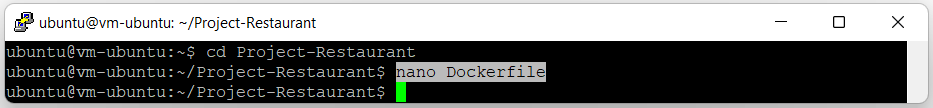

# 13 - KUIS 2

## Hasil Kuis 2 - Membuat Docker Image dari Project UTS dan Push di DockerHub.

- Langkah 1 : Membuka folder project.

    

- Langkah 2 : Push project ke repository Github.

    

- Langkah 3 : Melakukan clone project pada github dengan link berikut https://github.com/nailanabilaaaaaa/Project-Restaurant.git .

    

- Langkah 4 : Membuat file baru yang bernama Dockerfile.

    

- Langkah 5 : Menambahkan script didalam Dockerfile.

    

- Langkah 6 : Build Dockerfile tersebut menjadi sebuah images.

    .png)

    .png)

    .png)

    .png)

- Langkah 7 : Melakukan perintah docker images untuk mengecek image yang sudah dibuat.

    

- Langkah 8 : Melakukan perintah docker login untuk mengupload project ke docker hub.

    

- Langkah 9 : Mengupload images yang sudah dibuat ke docker hub.

    

- Langkah 10 : Masuk ke repository di docker hub, untuk mengecek images yang telah di upload.

    
